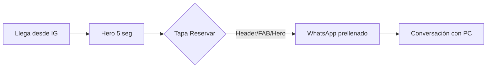
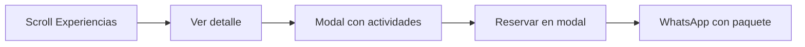
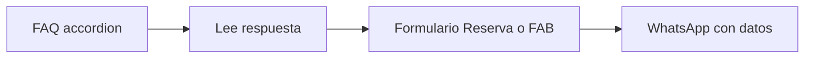

# Guía de Diseño UX/UI — Princess Club Web 2.0

## 1. Visión del producto

Landing de conversión para reservas vía WhatsApp. La madre/padre debe entender en **5 segundos** que Princess Club ofrece shows profesionales de princesas para eventos infantiles en CABA, y poder reservar en **máximo 2 taps** desde cualquier punto del sitio.

**Tono visual:** profesional + magia infantil. Capas suaves, micro-interacciones delicadas, sin sobrecarga ni estética "barata".

---

## 2. Personas

### Primary — Mamá organizadora (28–40 años)
- Descubre por Instagram o recomendación
- Poco tiempo, decide rápido por WhatsApp
- Alta exigencia estética (fotos del cumple, vestuario, puntualidad)
- **Necesita:** claridad de paquetes, confianza, CTA visible, FAQ que responda dudas reales

### Secondary — Organizador familiar/corporativo
- Busca proveedor confiable, puntual, con seguro
- **Necesita:** datos de contacto visibles, mención de actrices profesionales y cobertura CABA

---

## 3. Objetivos UX medibles

| Objetivo | Criterio de éxito |
|----------|-------------------|
| Comprensión instantánea | Headline ≤ 8 palabras; subheadline 1 línea |
| Conversión WhatsApp | FAB + header CTA + máx. 2 taps a wa.me |
| Confianza | Trust bar + testimonios + FAQ real |
| Mobile-first | 80%+ tráfico; touch targets ≥ 44px |
| Accesibilidad | Contraste 4.5:1; focus visible; skip link |

---

## 4. Arquitectura de información

Orden vertical (mobile y desktop — misma estructura, distinto layout):

```
Header (sticky)
├── Hero
├── Trust bar
├── Quienes somos
├── Catálogo Experiencias (6 cards)
├── Cómo funciona (NUEVO)
├── Video felicitación
├── Testimonios (NUEVO — visible)
├── FAQ
├── Reserva
├── Footer
└── FAB WhatsApp (flotante)
```

**Nav:** Inicio | Quienes somos | Experiencias | Video | Preguntas | Reserva

**Modal overlay:** detalle de paquete (no navegación nueva)

---

## 5. Flujos de usuario críticos

### Flujo A — Reserva rápida (objetivo principal)



**Taps:** 1 (CTA) → WhatsApp abierto.

### Flujo B — Comparar y elegir paquete



**Taps:** 2 (Ver detalle → Reservar).

### Flujo C — Resolver dudas antes de reservar



---

## 6. Decisiones UX por sección

### Header sticky
- **Problema v1:** nav empuja contenido 200px al abrir
- **v2:** drawer overlay con backdrop; contenido no se mueve
- Logo secundario mobile + CTA "Reservar" siempre visible en header
- Altura fija: 64px mobile / 80px desktop

### Hero
- **Problema v1:** 4 párrafos, poco visual
- **v2:** headline emocional + 1 subheadline + 1 párrafo corto máximo
- Layout mobile: copy arriba, imagen hero abajo (placeholder show real)
- Layout desktop: 2 columnas (copy 55% | visual 45%)
- 2 CTAs: primario "Reservar ahora" + secundario "Ver experiencias" (scroll suave)

### Trust bar
- 4 íconos en fila; scroll horizontal en mobile si no entran
- Refuerza credibilidad sin leer párrafos

### Quienes somos
- Texto máx. 3 líneas
- Galería swipe 3–5 fotos reales + dots
- Asset decorativo: `elementos_Princesas.png` en título

### Catálogo Experiencias
- Cards con jerarquía: badge opcional → nombre (Sour Gummy) → duración pill → tagline → 2 botones
- Badge "Más elegido" en Pack Sueño de Princesa (sugerido)
- Grid: 1 col mobile | 2 col tablet | 3 col desktop

### Modal detalle
- Título + duración destacada (Sour Gummy 900)
- Bullets con icono princesa (`elementos_Princesas.png`)
- CTA sticky en footer del modal
- Cierre: botón X + click backdrop + Escape

### Cómo funciona (nuevo)
- 3 pasos numerados con ícono circular soft
- Reduce fricción para usuarios que nunca reservaron por WhatsApp

### Video felicitación
- Bloque gradiente soft → accent (como v1, refinado)
- CTA único "Reservar Video"

### Testimonios (nuevo, visible)
- Carousel 3 items; 1 visible mobile, 3 desktop
- CTA "Dejar tu opinión" → WhatsApp

### FAQ
- 8 preguntas reales; primera abierta por defecto
- Accordion accesible (`details`/`summary` o ARIA)
- Asset: `preguntas.png`

### Reserva
- Formulario → WhatsApp con nombre, email, mensaje prellenados
- Copy confianza debajo: "Respondemos en menos de 24 hs"

### Footer
- Logo secundario, copyright, links Contacto | Opiniones
- Datos visibles: WhatsApp, email, CABA, horarios (no ocultos)

### FAB WhatsApp
- 56×56px, esquina inferior derecha
- `bottom: 16px; right: 16px` + padding-bottom en body para no tapar CTAs
- z-index 1030 (debajo modal/drawer)

---

## 7. Mejoras vs v1

| Área | v1 | v2 |
|------|----|----|
| Hero | 4 párrafos | Compacto + visual + 2 CTAs |
| Experiencias | Cards planas | Badge, duración pill, hover |
| FAQ | Lorem ipsum | 8 preguntas reales |
| Contacto/Opiniones | Ocultas | Footer + nav + secciones visibles |
| Nav mobile | Empuja 200px | Drawer overlay |
| Visual | Pattern sutil | Capas, decoración, micro-interacciones |

---

## 8. Uso de pattern.png

| Ubicación | Opacity | Modo |
|-----------|---------|------|
| Fondo secciones alternas (.alt) | 2–3% | repeat, cover |
| Modal body | 3–5% | repeat-x |
| Hero (opcional, esquina) | 2% | no-repeat |
| Cards, inputs, header | **NO** | — |
| Texto sobre pattern | **NO** sin overlay | — |

Regla: si el pattern compite con legibilidad, eliminarlo.

---

## 9. Accesibilidad

- **Contraste:** texto body `#124E78` sobre `#ffffff` = 7.2:1 ✓; `#ae8bbf` sobre `#f9f4fd` = verificar en textos largos → usar `--color-dark` para párrafos
- **Touch targets:** mínimo 44×44px (botones, nav links, FAB, accordion)
- **Focus visible:** `outline: 2px solid var(--color-accent); outline-offset: 2px`
- **Skip link:** "Saltar al contenido" → `#main`
- **Reduced motion:** desactivar fade-in scroll y transiciones largas
- **Modal:** trap focus, `aria-modal="true"`, `role="dialog"`
- **Carousel:** botones prev/next con `aria-label`; dots con `aria-current`

---

## 10. Jerarquía tipográfica

| Elemento | Mobile | Desktop | Fuente |
|----------|--------|---------|--------|
| H1 Hero | 32px / 1.2 | 40px / 1.15 | Bright Retro |
| H2 Sección | 28px / 1.2 | 40px / 1.15 | Bright Retro |
| H3 Card/Modal | 24px / 1.2 | 28px / 1.2 | Sour Gummy 400 |
| Nombre paquete | 28px | 32px | Sour Gummy 400 |
| Duración/badge | 14px | 16px | Sour Gummy 900 |
| Body | 16–18px / 1.5 | 18px / 1.5 | Garet 400 |
| Body bold | 18px / 1.5 | 18px / 1.5 | Garet 700 |
| Small/footer | 12–14px | 14px | Garet 400 |
| Botones | 16px | 16px | Garet 700 |

---

## 11. Spacing system

Base **4px**. Usar múltiplos: 4, 8, 12, 16, 24, 32, 48, 64, 80.

| Contexto | Mobile | Desktop |
|----------|--------|---------|
| Padding sección vertical | 48px | 80px |
| Container horizontal | 16px | 24px |
| Gap grid cards | 16px | 24px |
| Gap botones inline | 8–12px | 12px |
| Card padding | 16px | 24px |

---

## 12. Principios de conversión

1. **CTA primario siempre visible:** header + FAB
2. **Un objetivo por pantalla:** no competir con múltiples acciones iguales
3. **Prueba social antes de FAQ:** testimonios refuerzan confianza
4. **WhatsApp como único canal de cierre:** sin formularios que "envíen" sin salir del sitio (el form prellena WA, no POST)
5. **Reducir texto, aumentar señales visuales:** trust bar, fotos reales, duración en pill

---

## 13. Referencias visuales

- Mockups high-fidelity: `design/mockups.html`
- Wireframes: `design/wireframes-mobile.html`, `design/wireframes-desktop.html`
- Tokens: `css/tokens.css`
